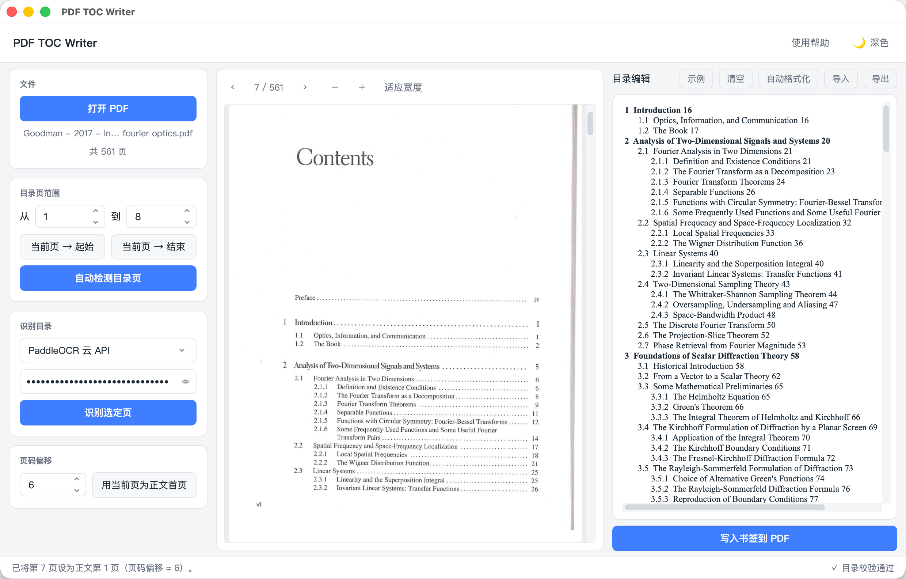

# PDF TOC Writer

[](https://github.com/zhufeng2/pdftocwriter/releases/tag/v1.0.0)
[](LICENSE)

Extract, edit, and write table of contents bookmarks into PDF files. Supports OCR for scanned PDFs.

## Features

- Auto-load existing PDF bookmarks into the editor
- Edit TOC text with auto-formatting by hierarchy level
- OCR support via PaddleOCR API for scanned PDFs
- Write the edited TOC as bookmarks into a copy of the target PDF

## Quick Start

### Download Executable (Windows)

Download the latest release from [GitHub Releases](https://github.com/zhufeng2/pdftocwriter/releases):
- `PDFTOCWriter.exe` — Standalone executable, no Python installation required

### From Source

**Requirements:** Python 3.10+

```bash
git clone https://github.com/zhufeng2/pdftocwriter.git
cd pdftocwriter
pip install pypdf requests
python main.py
```

## Usage

1. Click **Upload PDF** — upload the cropped table of contents PDF (not the full book PDF)
   - Existing bookmarks are loaded automatically if available
2. If no bookmarks, enter your API token and click **Start OCR** to extract TOC from the image
3. Edit the TOC in the editor, then click **Auto Format** to indent by level
4. Set **Page offset** if the PDF page numbers differ from the book's page numbers
5. Click **Write TOC to PDF**, select the **full book PDF** — a `*_toc.pdf` copy is created with the TOC bookmarks

## TOC Format

Each line follows `Title PageNumber`. Two-space indentation marks a sub-level:

```
Chapter 1 Introduction 1
  1.1 Background 1
  1.2 Purpose 2
    1.2.1 Scope 3
Chapter 2 Related Work 5
```

Auto Format detects the heading prefix (`1.1.1`, `Chapter`, `Section`, etc.) and applies indentation automatically.

## Screenshots


## Building from Source

### Prerequisites

```bash
pip install pyinstaller pypdf requests
```

### Build Executable

```bash
pyinstaller PDFTOCWriter.spec
```

Output: `dist/PDFTOCWriter/PDFTOCWriter.exe`

For a single-file executable, modify `PDFTOCWriter.spec` and set `onefile=True` in the EXE section.

## API Token

### Getting Your PaddleOCR API Token

The OCR feature requires a PaddleOCR API token. Follow these steps to get one:

1. Visit [PaddleOCR AI Studio](https://aistudio.baidu.com/paddleocr)
2. Sign up or log in with your Baidu account
3. Navigate to the API section and create a new API key
4. Copy your API token

### Using the Token

- Enter your token in the app's **API Token** field
- The token is stored locally in `~/.pdftocwriter.json` (outside the project directory, not tracked by git)
- Your token is never uploaded or shared

## Changelog

### v1.0.0 (2026-05-01)
- Initial release
- PDF bookmark extraction and editing
- OCR support for scanned PDFs
- Auto-formatting for table of contents
- Windows executable available

## License

MIT
